# RAGAcademic — Arsitektur & Diagram Alir Sistem

Dokumen ini memuat spesifikasi diagram sistem RAGAcademic pada tingkat detail yang
lazim dipakai pada naskah jurnal (IEEE). Setiap gambar disertai (a) sumber Mermaid
yang bisa langsung dirender, (b) daftar notasi, dan (c) parameter riil yang diambil
langsung dari kode — bukan asumsi.

**Basis kode yang didokumentasikan:** `RAGAcademic v0.3.0`
(commit `e1b6dc2`, branch `main`).

**Daftar Gambar**

| Gambar | Judul | Tipe |
|---|---|---|
| **Fig. 0** | **Ikhtisar Alur Sistem dalam Satu Gambar** | **Overview diagram** |
| Fig. 1 | Arsitektur Sistem Berlapis (Layered System Architecture) | Block diagram |
| Fig. 2 | Alur Pipa Indexing Luring (Offline Indexing Pipeline) | Data-flow diagram |
| Fig. 3 | Alur Pipa Kueri Daring Lima-Tahap (Online Query Pipeline) | Data-flow diagram |
| Fig. 4 | Mekanisme Hybrid Retrieval dengan Fusi RRF | Detail diagram |
| Fig. 5 | Diagram Sekuens: Unggah & Indexing Materi | Sequence diagram |
| Fig. 6 | Diagram Sekuens: Tanya-Jawab Multimodal | Sequence diagram |
| Fig. 7 | Mesin Keadaan Navigasi Katalog Terpandu | State machine |
| Fig. 8 | Diagram Deployment (Docker Compose) | Deployment diagram |
| Fig. 9 | Skema Data & Metadata Payload | Entity diagram |
| Fig. 10 | Lingkar Umpan Balik Human-in-the-Loop | Feedback loop |

---

## I. Ringkasan Sistem

RAGAcademic adalah *retrieval-augmented generation* (RAG) multimodal untuk materi
kuliah. Sistem menerima berkas heterogen (dokumen teks, presentasi, lembar kerja,
rekaman video/audio kuliah), menormalisasinya menjadi representasi tekstual yang
dapat ditelusuri, dan menjawab pertanyaan mahasiswa dengan jawaban terberkas
(*grounded*) beserta sitasi sumber.

Empat properti yang membedakannya dan perlu ditonjolkan di naskah:

1. **Ingesti multimodal terpadu.** Tabel dan gambar tidak dibuang; keduanya
   diringkas oleh LLM menjadi teks yang dapat disematkan (*embeddable*), tetapi
   **data mentahnya** (HTML tabel, base64 gambar) tetap disimpan dan diinjeksikan
   kembali ke konteks LLM saat menjawab. Ringkasan dipakai untuk *retrieval*, data
   asli dipakai untuk *grounding*. Ini menghindari kehilangan presisi angka.
2. **Retrieval hibrida satu-model.** BGE-M3 menghasilkan vektor *dense* (semantik,
   1024-d) dan *sparse* (leksikal ala BM25) dalam **satu kali forward pass**,
   lalu difusikan server-side oleh Qdrant memakai *Reciprocal Rank Fusion*.
3. **Dekomposisi kueri pra-retrieval.** Pertanyaan mahasiswa yang pendek/ambigu
   diperkaya lebih dulu menjadi kueri eksplisit sebelum penelusuran.
4. **Katalog terpandu berbasis indeks.** Hierarki mata kuliah → minggu → materi
   diturunkan dari isi indeks vektor itu sendiri, bukan dari basis data terpisah,
   sehingga tidak pernah menampilkan minggu/materi yang tidak punya konten.

---

## Fig. 0 — Ikhtisar Alur Sistem dalam Satu Gambar

Gambar tunggal yang memuat keseluruhan sistem: dari materi kuliah masuk, diolah,
disimpan sebagai vektor, lalu dipakai menjawab pertanyaan mahasiswa. Batas sistem
sengaja berhenti di respons API — aplikasi frontend milik pihak lain **tidak**
digambarkan karena bukan bagian yang dibangun di sini.

Kuncinya ada pada dua alur yang bertemu di satu titik. Alur A berjalan **luring**,
sekali saja per materi. Alur B berjalan **daring**, setiap kali ada pertanyaan.
Keduanya bertemu di basis data vektor Qdrant.

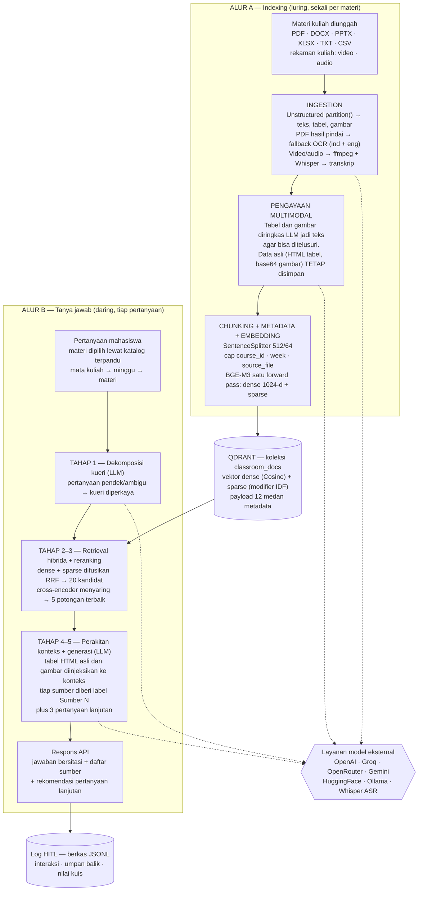

Tiga hal yang paling perlu dijelaskan saat mempresentasikan gambar ini:

1. **Ringkasan dipakai untuk mencari, data asli dipakai untuk menjawab.** Tabel dan
   gambar diringkas agar bisa ditemukan lewat pencarian semantik, tetapi saat
   menyusun jawaban yang diinjeksikan ke LLM adalah HTML tabel dan gambar aslinya.
   Inilah sebabnya angka pada tabel tetap presisi dan tidak rusak oleh ringkasan.
2. **Rekaman kuliah ikut bisa ditanya.** Video dan audio tidak diperlakukan sebagai
   lampiran mati; keduanya ditranskripsi lalu diindeks seperti dokumen biasa.
3. **Satu model menghasilkan dua representasi.** BGE-M3 mengeluarkan vektor dense
   dan sparse sekaligus dalam satu forward pass, sehingga pencarian makna dan
   pencarian kata kunci berjalan berdampingan tanpa memuat dua model terpisah.

Gambar ini adalah ikhtisar. Rincian tiap kotak ada pada Fig. 1 sampai Fig. 10.
Bila naskah hanya memuat sedikit gambar, **pakai gambar ini sebagai Fig. 1** lalu
geser penomoran gambar berikutnya.

---

## Fig. 1 — Arsitektur Sistem Berlapis

Diagram blok lima lapis. Panah padat = aliran permintaan/data; panah putus-putus =
pemanggilan layanan eksternal (jaringan).

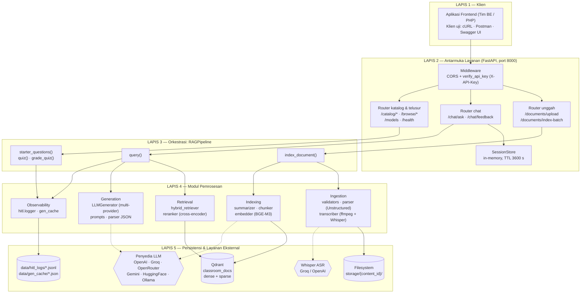

**Catatan implementasi untuk naskah**

| Komponen | Berkas | Parameter kunci |
|---|---|---|
| Autentikasi | `src/api/auth.py` | Header `X-API-Key`; nonaktif bila `RAGACADEMIC_API_KEY` kosong |
| Siklus hidup | `src/api/main.py` | `lifespan()` → `RAGPipeline()` + `ensure_collection()` sekali saat *startup* |
| Sesi | `src/api/session.py` | TTL 3600 s, riwayat maks. 10 giliran (20 pesan) |
| Konfigurasi | `src/config.py` | `pydantic-settings`, validasi silang `chunk_overlap < chunk_size` dan `rerank_top_k ≤ retrieval_top_k` |

---

## Fig. 2 — Alur Pipa Indexing Luring

Ini gambar terpenting untuk bagian *Methodology*. Perhatikan cabang media dan
cabang OCR — keduanya adalah kontribusi rekayasa yang layak dinarasikan.

Pipa ini terlalu panjang untuk satu gambar cetak, jadi disajikan sebagai dua panel.
Panel (a) menormalisasi berkas heterogen menjadi `ParsedElement`; panel (b)
mengubahnya menjadi titik vektor di Qdrant. Titik sambung keduanya adalah simpul
**E — "elements kosong?"**.

### Fig. 2(a) — Normalisasi masukan: berkas → ParsedElement

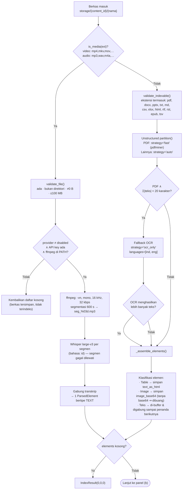

### Fig. 2(b) — Pengayaan, pemotongan, penyematan, dan penyimpanan

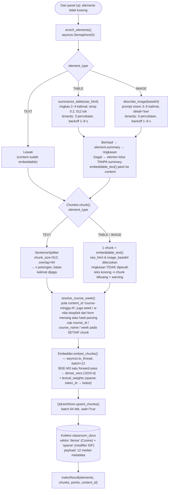

**Parameter numerik yang harus muncul di tabel naskah**

| Parameter | Nilai | Sumber |
|---|---|---|
| Ukuran chunk / tumpang tindih | 512 / 64 token | `chunk_size`, `chunk_overlap` |
| Dimensi vektor dense | 1024 | `embed_dim` |
| Ukuran batch embedding | 12 | `_DEFAULT_BATCH_SIZE` |
| Ukuran batch upsert | 64 titik | `_UPSERT_BATCH` |
| Konkurensi ringkasan multimodal | 5 | `max_concurrency` |
| Percobaan ulang LLM | 3, backoff eksponensial 1–8 s | `tenacity` |
| Ambang deteksi PDF hasil pindai | 20 karakter | `_MIN_PDF_TEXT_CHARS` |
| Durasi segmen audio | 600 s | `transcription_segment_seconds` |
| Batas ukuran unggahan | 100 MB | `max_upload_size_mb` |

---

## Fig. 3 — Alur Pipa Kueri Daring Lima-Tahap

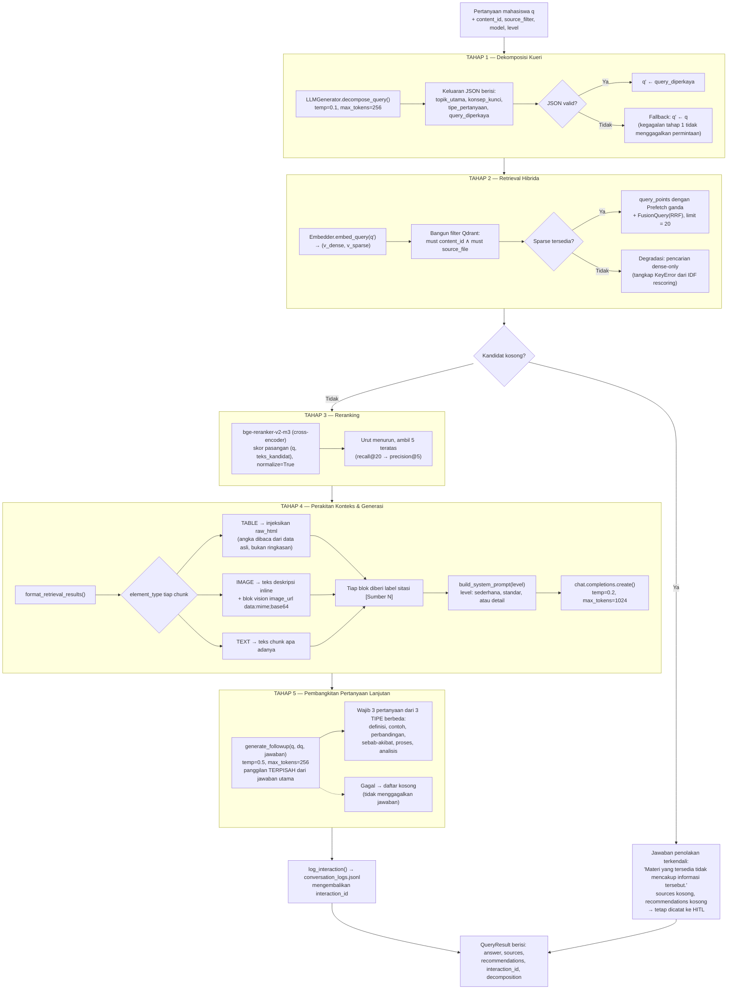

**Perhatikan untuk pembahasan (*Discussion*):** total 3 panggilan LLM per pertanyaan
(dekomposisi → jawaban → lanjutan). Latensi ujung-ke-ujung direkam di
`elapsed_seconds` pada log HITL, sehingga sudah tersedia bahan untuk tabel evaluasi
latensi tanpa instrumentasi tambahan.

---

## Fig. 4 — Mekanisme Hybrid Retrieval dengan Fusi RRF

Gambar khusus untuk bagian metode retrieval. Ini yang paling sering diminta reviewer.

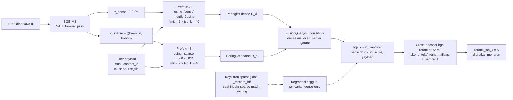

**Formulasi matematis untuk naskah**

Kemiripan dense antara kueri dan chunk:

$$\mathrm{sim}_{d}(q,c) = \frac{\mathbf{v}_q \cdot \mathbf{v}_c}{\lVert \mathbf{v}_q \rVert \lVert \mathbf{v}_c \rVert}$$

Skor sparse dengan modifier IDF pada Qdrant:

$$\mathrm{sim}_{s}(q,c) = \sum_{t \in q \cap c} w_{q,t} \cdot w_{c,t} \cdot \mathrm{idf}(t)$$

Fusi Reciprocal Rank Fusion atas kedua daftar peringkat:

$$\mathrm{RRF}(c) = \sum_{r \in \{R_d, R_s\}} \frac{1}{k + \mathrm{rank}_r(c)}, \quad k = 60 \ \text{(default Qdrant)}$$

Skor akhir yang menentukan urutan konteks LLM:

$$s_{\text{final}}(c) = \sigma\big(f_{\text{CE}}(q, \text{teks}(c))\big), \quad \text{ambil } \arg\max_{5}$$

dengan $f_{\text{CE}}$ adalah cross-encoder dan $\sigma$ normalisasi sigmoid.

---

## Fig. 5 — Diagram Sekuens: Unggah & Indexing Materi

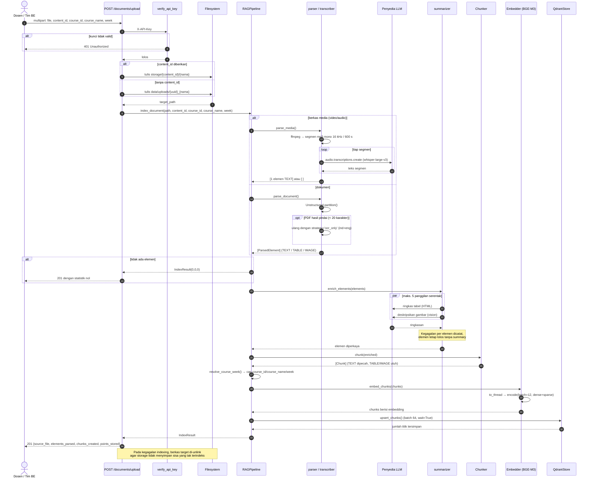

---

## Fig. 6 — Diagram Sekuens: Tanya-Jawab Multimodal

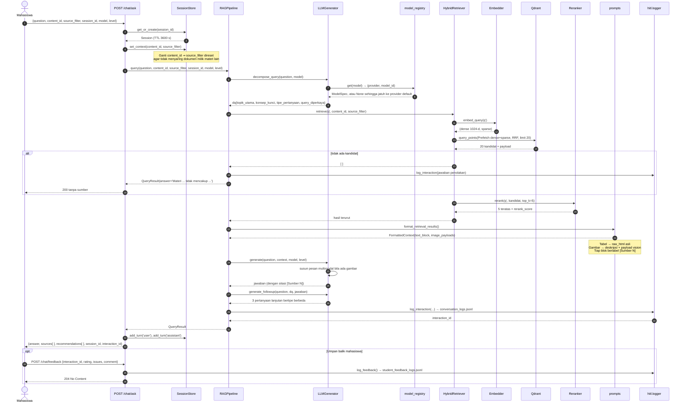

**Peringatan akurasi untuk naskah.** `Session.history` diisi oleh `add_turn()`
tetapi **tidak pernah dibaca** kembali — riwayat percakapan tidak diinjeksikan ke
prompt LLM (lihat `src/api/session.py`; tidak ada pembaca `.history` di seluruh
`src/`). Sesi saat ini hanya berfungsi mempertahankan `content_id` dan
`source_filter` antar permintaan. Jadi jangan mengklaim sistem ini mendukung
*multi-turn conversational memory*; klaim yang benar adalah **persistensi konteks
materi antar permintaan**. Bila memang ingin mengklaim yang pertama, riwayat harus
diteruskan ke `RAGPipeline.query()` dan dimasukkan ke daftar `messages`.

---

## Fig. 7 — Mesin Keadaan Navigasi Katalog Terpandu

Alur ini menjawab masalah *"mahasiswa tidak tahu harus bertanya apa"* — navigasi
dengan klik, bukan mengetik prompt.

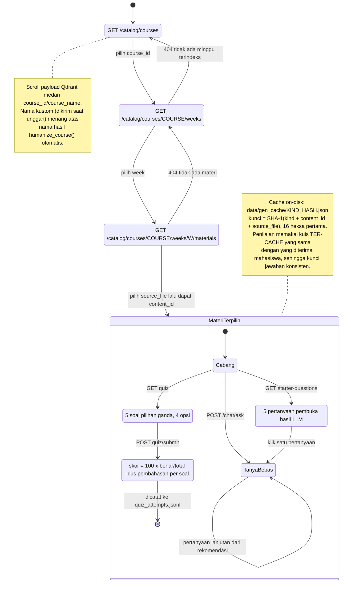

---

## Fig. 8 — Diagram Deployment

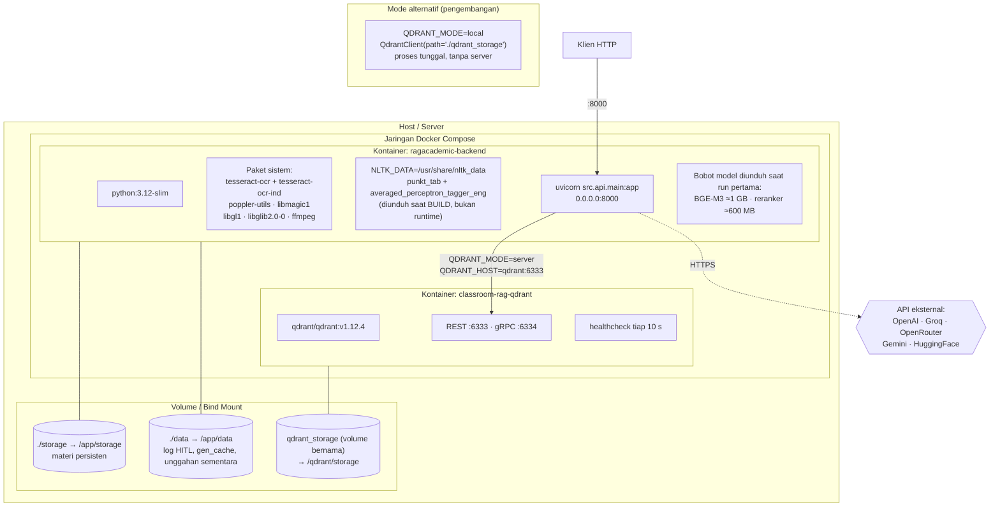

**Catatan penting untuk bagian reproduksibilitas naskah:** mode `local` memakai
klien Qdrant tertanam berbasis berkas (satu proses saja); mode `server` dipakai di
Docker/produksi. `docker-compose.yml` menimpa `QDRANT_MODE=server` secara eksplisit
agar backend tidak pernah tanpa sengaja memakai mode tertanam di dalam kontainer.

---

## Fig. 9 — Skema Data & Metadata Payload

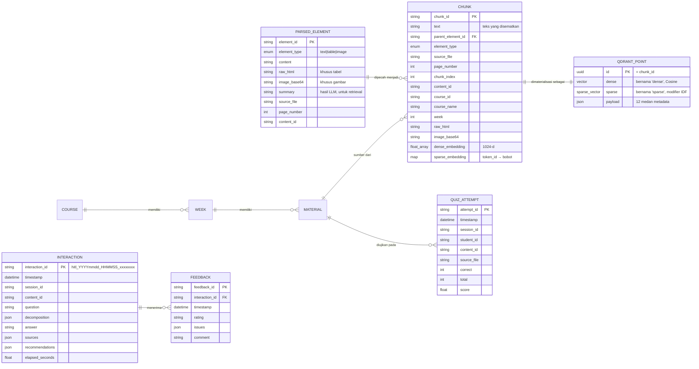

Perhatikan bahwa tidak ada RDBMS. Hierarki katalog **diturunkan** dari medan payload
`course_id` / `week` / `source_file` di dalam Qdrant melalui operasi `scroll` +
deduplikasi. Ini keputusan desain yang layak dibahas: menghilangkan sinkronisasi
ganda antara basis data metadata dan indeks vektor, dengan konsekuensi biaya
pemindaian meningkat seiring pertumbuhan koleksi.

---

## Fig. 10 — Lingkar Umpan Balik Human-in-the-Loop

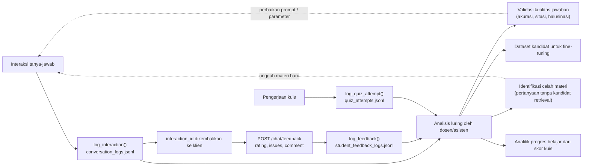

Lingkar ini **luring dan tidak otomatis** — tidak ada pembelajaran daring. Nyatakan
demikian secara eksplisit di naskah agar tidak dituduh mengklaim *online learning*
yang tidak ada.

---

## II. Panduan Menggambar Ulang di Platform Lain

Blok Mermaid di atas bisa langsung dipakai, tetapi untuk naskah IEEE Anda
kemungkinan besar butuh gambar vektor yang memenuhi ketentuan format. Berikut
panduannya.

### A. Ketentuan gambar IEEE yang wajib dipenuhi

| Aspek | Ketentuan |
|---|---|
| Lebar | 3,5 inci (88 mm) untuk satu kolom; 7,16 inci (181 mm) untuk dua kolom |
| Format | Vektor: PDF atau EPS. Bila raster: ≥600 dpi untuk *line art* |
| Fonta | Times New Roman / Times, 8–10 pt di dalam gambar |
| Warna | Harus tetap terbaca dalam skala abu-abu; bedakan dengan pola/garis, jangan hanya warna |
| Caption | Di **bawah** gambar, format `Fig. 1. Kalimat deskriptif.` (titik setelah nomor) |
| Ketebalan garis | Minimal 0,5 pt agar tidak hilang saat dicetak |

### B. Alur kerja tercepat: Mermaid → SVG → penyuntingan vektor

1. Buka <https://mermaid.live>, tempel salah satu blok di atas.
2. Panel **Config**, atur agar cocok untuk cetak:
   ```json
   {
     "theme": "neutral",
     "fontFamily": "Times New Roman, serif",
     "fontSize": 14,
     "flowchart": { "curve": "linear", "nodeSpacing": 40, "rankSpacing": 55 },
     "themeVariables": {
       "primaryColor": "#ffffff",
       "primaryBorderColor": "#000000",
       "primaryTextColor": "#000000",
       "lineColor": "#000000"
     }
   }
   ```
   Konfigurasi ini menghasilkan gambar hitam-putih bergaris tegas — persis yang
   diinginkan penerbit.
3. **Actions → SVG**, unduh.
4. Buka SVG di Inkscape (gratis) atau Illustrator, rapikan penempatan label, lalu
   **File → Save As → PDF**. Di Inkscape, centang *"Convert text to paths"* agar
   fonta tidak bergeser di komputer penerbit.
5. Untuk LaTeX: `\includegraphics[width=\columnwidth]{fig1.pdf}`.

### C. Alternatif: draw.io (paling terkontrol)

1. Buka <https://app.diagrams.net> → **Extras → Edit Diagram**, atau
   **Arrange → Insert → Advanced → Mermaid** dan tempel blok Mermaid — draw.io akan
   mengubahnya menjadi bentuk yang bisa Anda geser satu per satu.
2. Terapkan gaya seragam. Pilih semua → **Edit Style**:
   ```
   rounded=0;whiteSpace=wrap;html=1;fontFamily=Times New Roman;fontSize=9;
   strokeWidth=1;fillColor=none;strokeColor=#000000;fontColor=#000000;
   ```
3. Konvensi bentuk yang konsisten (dan sebutkan konvensinya di caption):
   - Persegi panjang → modul komputasi
   - Belah ketupat → titik keputusan
   - Silinder → penyimpanan persisten
   - Heksagon / persegi panjang bergaris putus → layanan eksternal
   - Persegi panjang bersudut ganda → subproses yang dirinci di gambar lain
4. **File → Export as → PDF**, centang *Crop* dan *Transparent Background*.

### D. Untuk pengguna LaTeX: TikZ

Kualitas terbaik dan fonta otomatis konsisten dengan badan naskah. Kerangka untuk
Fig. 3 (pipa kueri lima-tahap):

```latex
\usepackage{tikz}
\usetikzlibrary{shapes.geometric, arrows.meta, positioning, fit, backgrounds}

\tikzset{
  mod/.style   = {rectangle, draw, minimum width=2.6cm, minimum height=0.8cm,
                  align=center, font=\footnotesize},
  dec/.style   = {diamond, draw, aspect=2, align=center, font=\scriptsize,
                  inner sep=1pt},
  store/.style = {cylinder, draw, shape aspect=.3, shape border rotate=90,
                  align=center, font=\scriptsize},
  ext/.style   = {rectangle, draw, dashed, align=center, font=\scriptsize},
  fl/.style    = {-{Latex[length=2mm]}, thick},
  stage/.style = {draw, dotted, thick, inner sep=4pt, rounded corners}
}

\begin{figure}[!t]
\centering
\begin{tikzpicture}[node distance=0.75cm]
  \node[mod] (q)  {Pertanyaan $q$};
  \node[mod, below=of q]  (s1) {Tahap 1: Dekomposisi\\$q \rightarrow q'$};
  \node[mod, below=of s1] (s2) {Tahap 2: Retrieval hibrida\\(RRF, top-$k$=20)};
  \node[mod, below=of s2] (s3) {Tahap 3: Reranking\\(cross-encoder, top-5)};
  \node[mod, below=of s3] (s4) {Tahap 4: Perakitan konteks\\+ generasi};
  \node[mod, below=of s4] (s5) {Tahap 5: Pertanyaan lanjutan};
  \node[store, right=1.4cm of s2] (qd) {Qdrant};
  \node[ext, right=1.4cm of s4]   (llm) {LLM};

  \draw[fl] (q)--(s1); \draw[fl] (s1)--(s2); \draw[fl] (s2)--(s3);
  \draw[fl] (s3)--(s4); \draw[fl] (s4)--(s5);
  \draw[fl, <->] (s2)--(qd);
  \draw[fl, <->, dashed] (s4)--(llm);
\end{tikzpicture}
\caption{Alur pipa kueri daring lima-tahap pada RAGAcademic.}
\label{fig:query-pipeline}
\end{figure}
```

### E. Prioritas: gambar mana yang masuk naskah

Naskah IEEE biasanya memuat 4–6 gambar. Rekomendasi untuk *Conference Paper*
8 halaman:

| Prioritas | Gambar | Ditempatkan di bagian |
|---|---|---|
| **Wajib** | Fig. 1 (arsitektur berlapis) | *System Overview* |
| **Wajib** | Fig. 2 (pipa indexing) | *Methodology — Ingestion & Indexing* |
| **Wajib** | Fig. 3 (pipa kueri) | *Methodology — Query Processing* |
| **Sangat dianjurkan** | Fig. 4 (RRF) | *Methodology — Hybrid Retrieval*, sertai persamaan |
| Opsional | Fig. 7 (katalog terpandu) | *User Interaction Design* |
| Opsional | Fig. 9 (skema data) | *Implementation* |
| Lampiran | Fig. 5, 6, 8, 10 | Materi tambahan / repositori |

Fig. 5 dan Fig. 6 (sekuens) sebaiknya **digabung menjadi satu gambar dua panel**
(panel (a) indexing, panel (b) kueri) bila tetap ingin dimasukkan — diagram sekuens
memakan ruang vertikal besar dan sering ditolak reviewer karena informasinya sudah
tercakup di Fig. 2 dan Fig. 3.

### F. Contoh caption siap pakai

> Fig. 1. Arsitektur berlapis RAGAcademic. Panah padat menyatakan aliran
> permintaan/data internal; panah putus-putus menyatakan pemanggilan layanan
> eksternal melalui jaringan. Silinder menyatakan penyimpanan persisten.

> Fig. 2. Pipa indexing luring. Berkas media dialihkan ke jalur transkripsi
> (ffmpeg + Whisper), sedangkan dokumen melalui Unstructured dengan mekanisme
> mundur OCR untuk PDF hasil pindai. Elemen tabel dan gambar diringkas oleh LLM
> untuk keperluan penelusuran, sementara data mentahnya tetap dipertahankan.

> Fig. 3. Pipa kueri daring lima-tahap. Setiap pertanyaan memicu tiga kali
> pemanggilan LLM: dekomposisi kueri, sintesis jawaban, dan pembangkitan
> pertanyaan lanjutan.

> Fig. 4. Mekanisme retrieval hibrida. BGE-M3 menghasilkan representasi dense dan
> sparse dalam satu forward pass; keduanya difusikan dengan Reciprocal Rank Fusion
> di sisi server sebelum diperingkat ulang oleh cross-encoder.

---

## III. Rujukan Silang Kode

| Elemen diagram | Berkas | Fungsi/kelas kunci |
|---|---|---|
| Titik masuk API | [src/api/main.py](../src/api/main.py) | `lifespan()`, `app` |
| Autentikasi | [src/api/auth.py](../src/api/auth.py) | `verify_api_key()` |
| Orkestrator | [src/pipeline.py](../src/pipeline.py) | `RAGPipeline.index_document()`, `.query()` |
| Parser dokumen | [src/ingestion/parser.py](../src/ingestion/parser.py) | `parse_document()`, `_try_ocr()` |
| Transkripsi media | [src/ingestion/transcriber.py](../src/ingestion/transcriber.py) | `parse_media()`, `_extract_audio_segments()` |
| Validasi berkas | [src/ingestion/validators.py](../src/ingestion/validators.py) | `validate_indexable()` |
| Ringkasan multimodal | [src/indexing/summarizer.py](../src/indexing/summarizer.py) | `enrich_elements()` |
| Pemotongan | [src/indexing/chunker.py](../src/indexing/chunker.py) | `Chunker.chunk()` |
| Penyematan | [src/indexing/embedder.py](../src/indexing/embedder.py) | `Embedder.embed_chunks()` |
| Retrieval hibrida | [src/retrieval/hybrid_retriever.py](../src/retrieval/hybrid_retriever.py) | `HybridRetriever.retrieve()` |
| Reranking | [src/retrieval/reranker.py](../src/retrieval/reranker.py) | `Reranker.rerank()` |
| Basis data vektor | [src/storage/qdrant_store.py](../src/storage/qdrant_store.py) | `search()`, `upsert_chunks()` |
| Generasi | [src/generation/llm.py](../src/generation/llm.py) | `LLMGenerator.generate()`, `.decompose_query()` |
| Prompt & konteks | [src/generation/prompts.py](../src/generation/prompts.py) | `format_retrieval_results()` |
| Katalog | [src/catalog.py](../src/catalog.py) | `resolve_course_week()` |
| Registry model | [src/model_registry.py](../src/model_registry.py) | `available()` |
| Log HITL | [src/hitl/logger.py](../src/hitl/logger.py) | `log_interaction()`, `log_feedback()` |
| Cache generasi | [src/gen_cache.py](../src/gen_cache.py) | `load()`, `save()` |
| Konfigurasi | [src/config.py](../src/config.py) | `Settings` |
| Deployment | [docker-compose.yml](../docker-compose.yml), [Dockerfile](../Dockerfile) | — |
